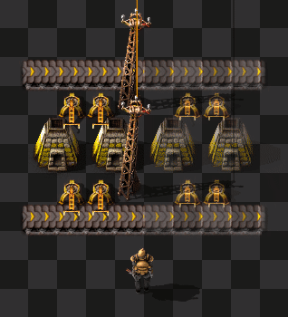
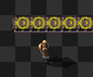
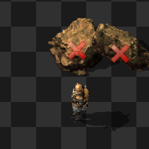

# Mouse-over Construction

Mouse-over Construction is a Factorio mod easing the process of building blueprints before construction bots have been researched.

## Features

When mouse-over is enabled via the shortcut button or hotkey (default `Shift + Y`), the following features are available for entities within your reach range:

### Construction

Ghosts within range will be automatically revived if you have the proper materials in your inventory.

### Upgrading

Entities within range that are marked for upgrade will be automatically upgraded if you have the proper materials in your inventory.

### Deconstruction

Entities within range that are marked for deconstruction will be automatically mined.

